# 🧠 Digital Memory — Backend

**Live Demo:** [https://digital-memory-web.vercel.app](https://digital-memory-web.vercel.app)

**Frontend Github:** [https://github.com/AditiAmbasta13/digital-memory-frontend](https://github.com/AditiAmbasta13/digital-memory-frontend)

**Digital Memory** is the AI-powered backend engine for processing knowledge. It ingests various content forms (PDFs, URLs, texts), extracts meaningful entities, relationships, summaries, and organizes everything into a semantic graph for search and visualization.

## 🚀 Quick Start

Ensure you have Python 3.11+ installed. Set up your virtual environment and install requirements:

```bash
python -m venv venv
source venv/bin/activate  # On Windows: venv\Scripts\activate
pip install -r requirements.txt
```

Run the FastAPI application via uvicorn:

```bash
uvicorn app.main:app --reload --host 0.0.0.0 --port 8000
```

Head over to [http://localhost:8000/docs](http://localhost:8000/docs) to access the interactive Swagger AI documentation.

## 🛠️ Tech Stack & Storage

- **Framework:** FastAPI (Python)
- **Database (Relational):** SQLite (`digital_memory.db`) via SQLAlchemy.
- **Database (Graph):** In-memory JSON (`graph_store.json`) with an adapter mapped for **Neo4j AuraDB** cloud configurations.
- **Database (Vector):** **ChromaDB** (`vector_store.json`) for chunk-based text embeddings.
- **Blob Storage:** **MongoDB GridFS** specifically stores scalable, streamed PDF uploads smoothly.
- **AI Core:** [Groq](https://groq.com/) using `llama-3.3-70b-versatile` for fast LLM-based intelligent extraction.
- **Offline NLP Fallback:** Contains an intelligent downgrade route using `spaCy` (`en_core_web_sm`) if API calls fail, ensuring functionality never dies.

## 🔗 Environment Variables Setup

Root `.env` must contain API keys and mapping options:

```env
APP_NAME="Digital Memory System"
DEBUG="true"
ALLOWED_ORIGINS="http://localhost:3000,http://127.0.0.1:3000"

# Graph Store
NEO4J_URI=bolt://localhost:7687
NEO4J_USER=neo4j
NEO4J_PASSWORD=password

# Semantic Search
CHROMA_PERSIST_DIR=./chroma_data
EMBEDDING_MODEL=all-MiniLM-L6-v2

# AI Engines
GROQ_API_KEY=your-groq-api-key

# Blob Document Store
MONGO_URI=your-mongodb-atlas-uri
MONGO_DB_NAME=digital_memory
```

## 🏗️ Internal Data Pipeline

```mermaid
sequenceDiagram
    participant User
    participant Router
    participant SQLite
    participant MongoDB
    participant GroqLLM
    participant GraphDB

    User->>Router: POST /api/content/upload (File/URL)
    Router->>MongoDB: Store PDF via GridFS (Return file_id)
    Router->>SQLite: Log Document Meta (State: Unprocessed)
    
    rect rgb(23, 31, 41)
        note right of SQLite: Intelligent Entity & Summary Extraction
        Router->>GroqLLM: Contextualize Content
        GroqLLM-->>Router: JSON Entities & Relations
    end

    Router->>GraphDB: Inject Nodes & Edges mapped dynamically
    Router->>SQLite: Flag Processed (Update Summaries)
```



## 🧩 Key System Features
- **Graceful API Degradation:** If `GROQ_API_KEY` exhausts or errors out, `groq_service.py` safely switches all traffic processing to `spaCy` extraction workflows using dependency mapping.
- **"Explain Graph" Mode:** By combining graph algorithms and deep querying, multiple connected elements narrate coherent cross-connected explanations in chronological logic chunks. 
- **Hybrid Storage Migration:** Employs GridFS to handle high-volume PDFs gracefully mapped to the primary internal SQLite logic tree natively resolving performance blockers.
